
<h1 align="center">基于技术的美食烹饪互动平台的设计与实现</h1>

## 简介
一个基于Spring Boot开发的美食烹饪互动平台，功能涵盖用户注册与登录、个人信息管理、烹饪视频与美食菜谱浏览、评论互动、公告管理及后台管理，增强用户的美食分享与互动体验。    --计算机毕业设计源码；毕设源码；java毕业设计源码

## 联系方式

<h3 align="center">获取完整代码与数据库文件 + 微信：deepguan QQ: 86050149 QQ群: 783742310</h3>

<h3 align="center">可帮忙远程部署 包运行成功！提供远程部署、修改代码、设计文档指导、代码讲解等服务！</h3>

## 功能介绍（完整见运行截图）
管理员：基本功能包括登录、注册、退出，以及通过导航栏访问主页、公告管理、用户管理、美食管理和留言管理。管理员可以通过商品列表管理平台展示内容，添加、修改和删除公告类型；管理用户信息；回复用户留言以及查看和编辑各种美食信息。个人中心支持管理员查看和更新个人信息，管理密码，提升个人的操作体验。  
用户：基本功能支持登录、注册、退出，用户可通过导航栏轻松访问首页、个人中心、私家菜、养生食疗、公告等功能模块。个人中心提供用户信息编辑、个人头像上传功能以及查看和修改个人账号信息的选项，包括查看已发布和收藏的菜谱。用户还可以搜索和浏览美食信息、观看烹饪视频、参与评论交流，从而与其他用户更深层次互动，分享烹饪体验。

## 运行截图
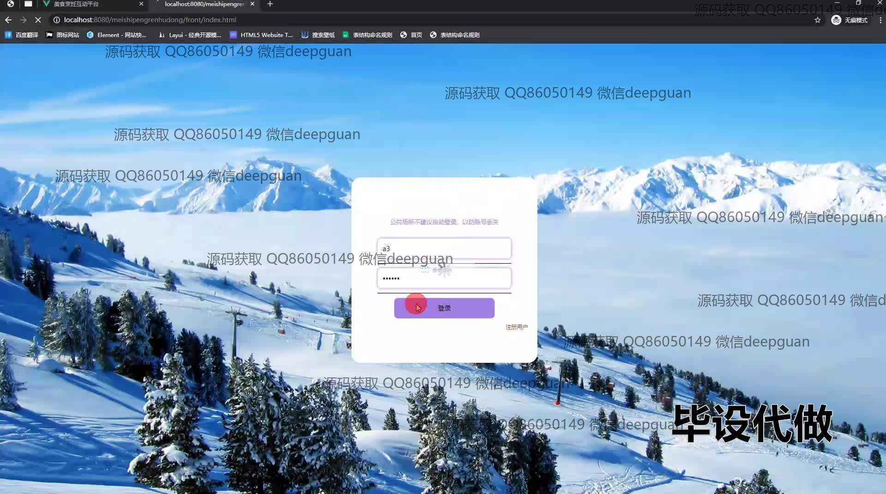
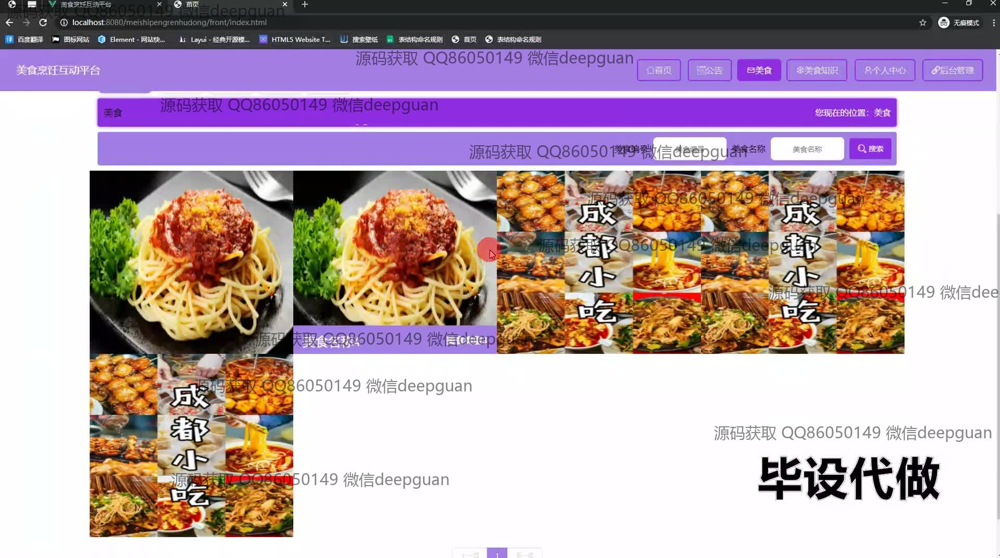
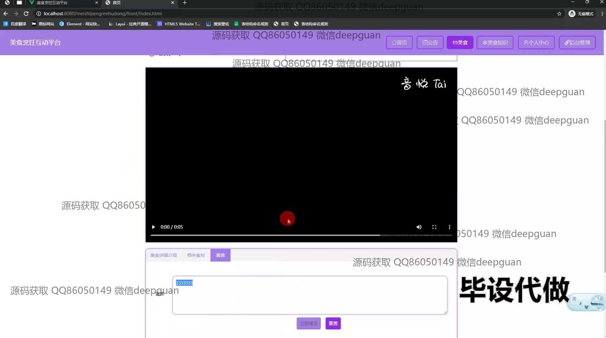
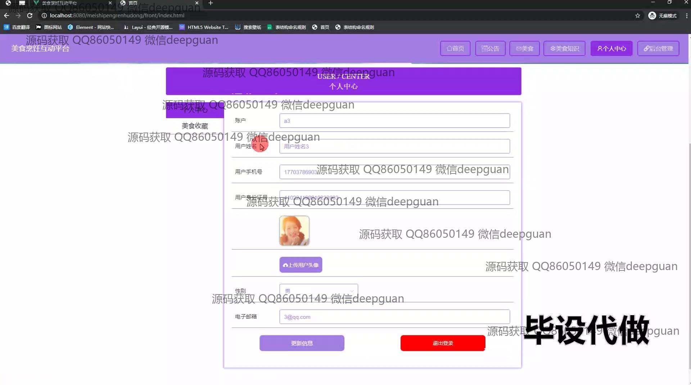
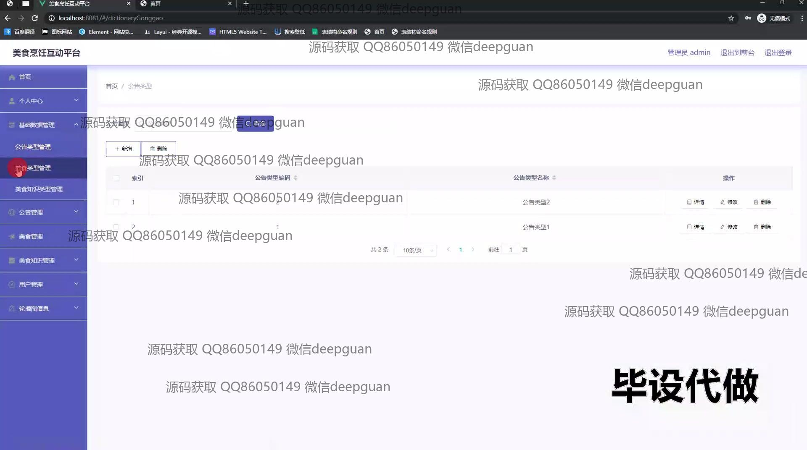
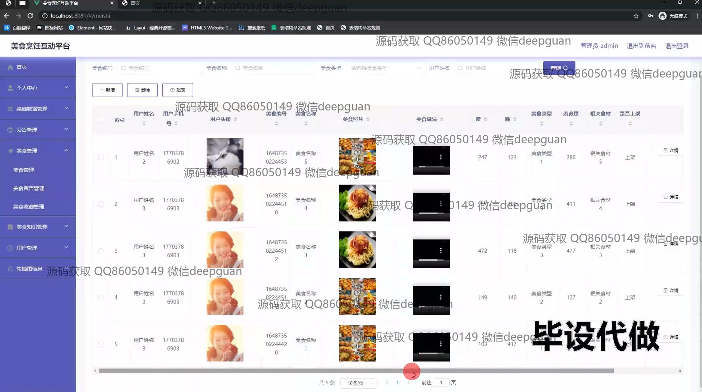
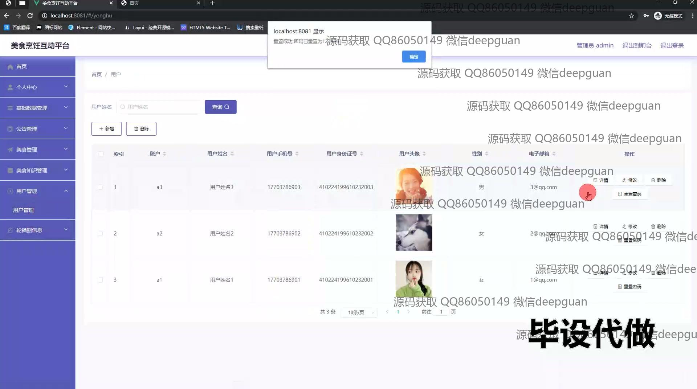
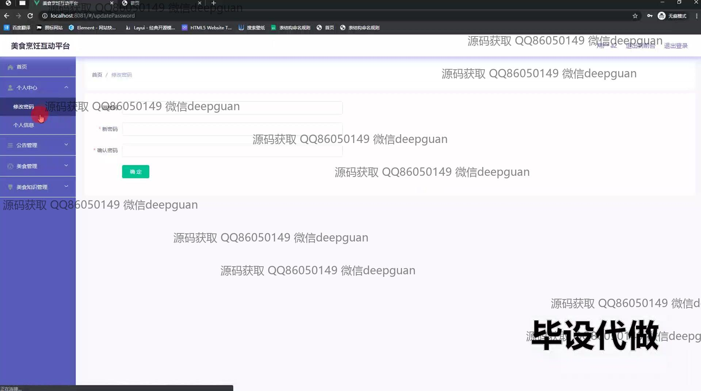
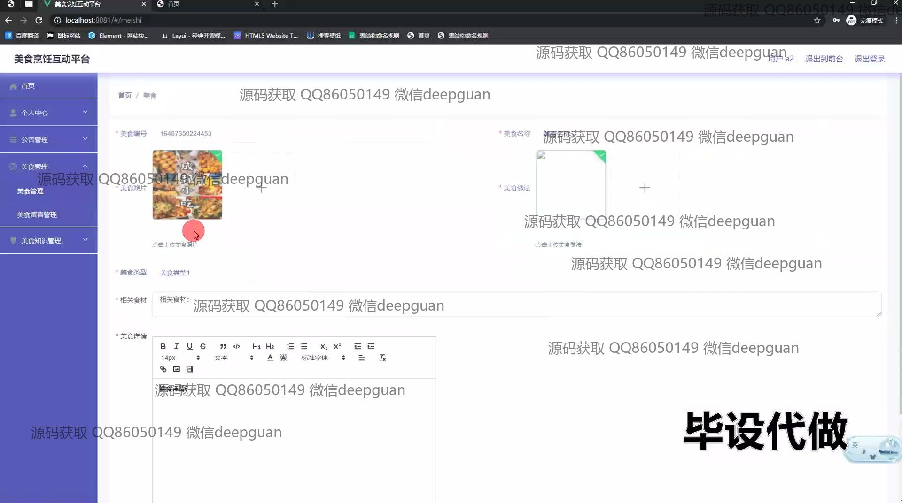
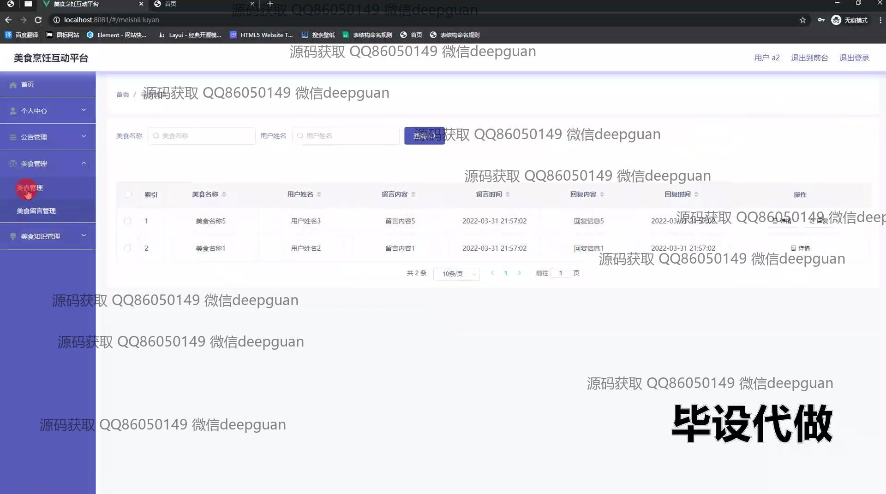
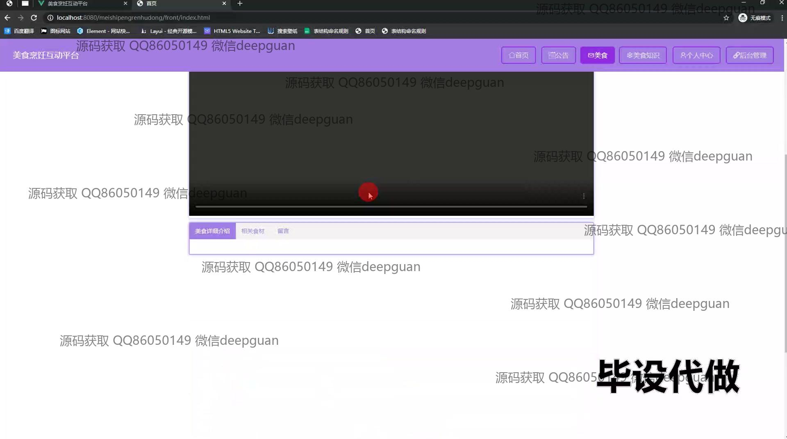
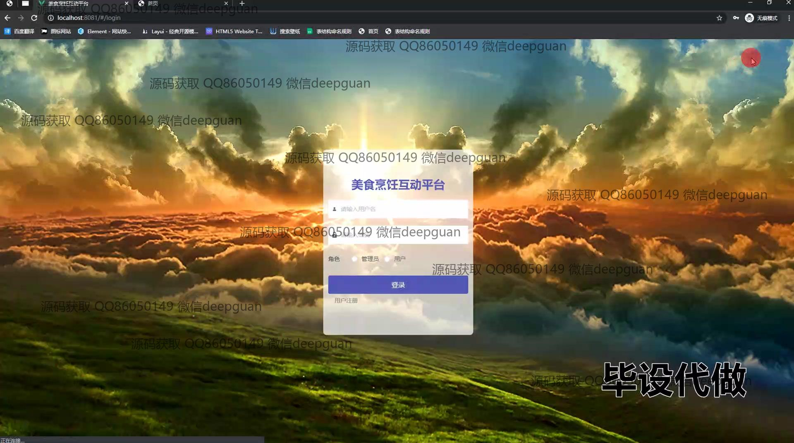
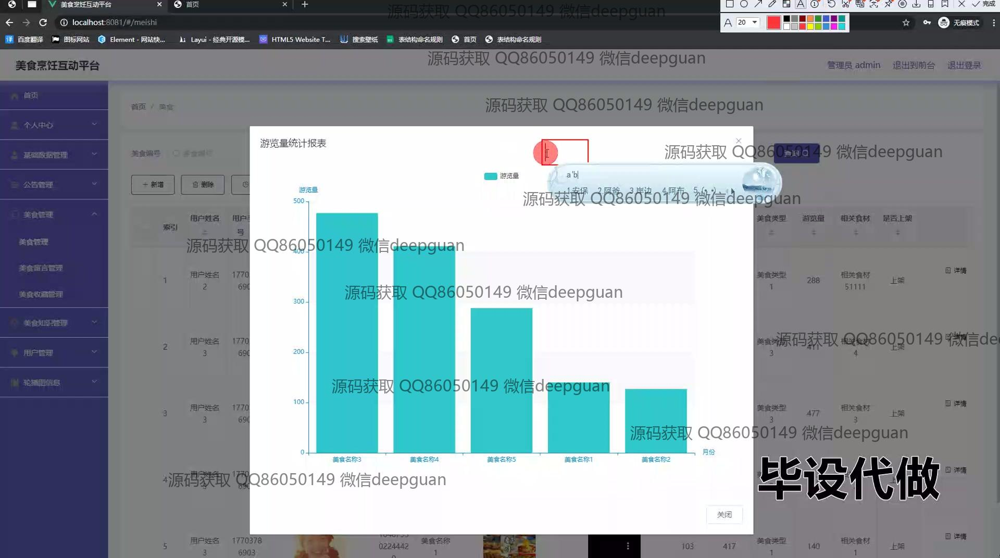

本代码来源于网络,仅供学习参考使用!

